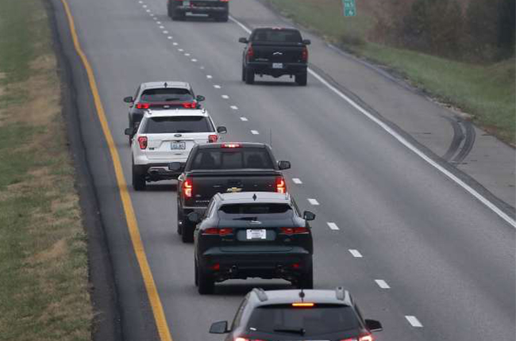
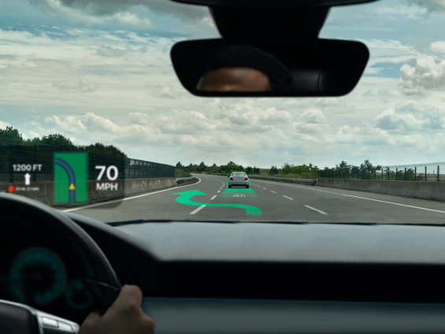
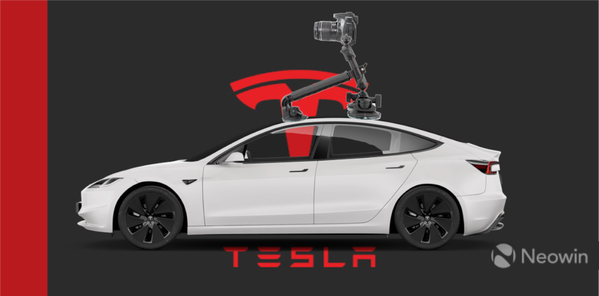

#### It's 8 pm - 3 hours after you texted your wife that you were leaving work. You finally restored the production database using the rsync backup after your co-workers ```rm -rf``` mishap. You're weak, and despite the SpaghettiOs&reg; that are getting cold on the counter at home, decide that you will stop at Chipotle for a bowl. But on the way, you meet this guy:



[source](https://www.autodeal.com.ph/articles/car-features/toxic-driving-habits-we-should-stop-asap-editor-speaks)

#### See anything wrong? I certainly do: These damn left lane sitters slowing everyone down! And that's not all, they force you into the moral dilemma of whether or not to break the rules you wish were followed so badly by passing on the right!

___

# Vision

The vision is a system designed to improve driving times by lowering the margin of error of standard driving maneuvers, while maintaining or lowering crash risks. Such a system would allow for tighter and quicker lane changes, while maintaining an individualized vehicle operating status, as opposed to achieving this via local-area communications (e.g. "I'm merging right. Blue Tesla in the right lane, speed up slightly!").

The system is an environment modeling, path planning algorithm coupled with necessary hardware upgrades and visualization components to provide utility to the driver, whether that be an individual or a machine.

Specifically:

An augmented reality view of the road shows doable lane changes to progress through traffic. This may be a Heads-Up Display (HUD) projected on the windshield, or optical see-through Virtual Reality (VR) glasses.



[source](https://www.fierceelectronics.com/electronics/what-augmented-reality-0)


This HUD is a visualization of the path planning algorithm output, informed by a mechanized and stabilized camera tripod setup on the roof of the car.



[source 1](https://www.neowin.net/news/tesla-almost-doubled-its-deliveries-in-2021-compared-to-the-previous-year/) [source 2](https://www.carwow.co.uk/tesla/model-3/colours#gref) [source 3](https://www.amazon.com/Delkin-DDMNT-TRIPLE-Gecko-Three-Arm-Suction/dp/B00A86MMY8/)

This external component is necessary to improve line of sight, enabling better object tracking, and reducing the required algorithmic compensation for persistent tracking of occluded objects. This being said, I will be implementing this component, as it sounds like one of the more interesting parts of the project. 

A positive externality of this raised sensor is that it improves maximum performance for any potential police detection algorithms, which could come with an associated alert system to help you avoid speeding tickets.

# Citations

None yet

# Appendix

## Hand-Wavy Utilitarian-Based* Moral Argument
**\*** "based" meaning foundation, [as well as "admirable"](https://www.urbandictionary.com/define.php?term=based)

TL;DR: Hereafter, I calculate the time-loss caused by left-lane sitters. I compare this to the lifespan loss expected by 10x'ing your risk to overtake, both on an individual and societal perspective. On a societal level the driver who "recklessly swerves around the left-lane sitter" is in fact causing equivalent harm as the left-lane sitter over both of their lifetimes! If you have hatred towards the people who flash or honk behind you when you are going slow in the left lane, only to pass you on the right, and you want to be logically consistent, you should harbor just as much hatred towards yourself.

 1. The value of life, subjectively defined of course, is the amount of time left you are able to exhibit a meaningful <sup>[0](#myfootnote0)</sup> conscious experience. Implicitly, I value a life of "good" or "meaningful" experiences highly. On the other side of that coin, a life obstructed from meaningful conscious experience, such as a life of solitary imprisonment, whether it to be literally <sup>[1](#myfootnote1)</sup> , or metaphorically <sup>[2](#myfootnote2)</sup>. 
 2. The activity of "traveling" is not a value-providing action under my definition in proposition [1].
 3. Suppose the driver is new, and will not change their left-lane riding behavior for the rest of their life. The average American adult drives 37,935 hours in their life, equating to 101 minutes per day. Using some strong assumptions and scratch math, let's assume most of that is commuting time on the highway, say 60%. This person could spend a total of 22,761 hours in the left lane. Using fermi-style approximations, let's say on average, out of the 60 minutes per day of highway driving, 10 cars are held up by 1 minute. Therefore, we can compute the total opportunity cost the other drivers faced due to this individuals left-lane driving to be 3793.5 hours, or equivalently 0.43 years.

    All together:

    

 4. On average, the rate of annual car crash fatalities is about 15 per 100,000 people, and only ~1/10 of those are due to speeding and reckless or careless driving, with the equivalent probability being 0.000015. Assuming one lives for 78 years total, the extrapolated probability of dying in a car accident is 1-(1 - 0.000015)^78, or 0.0012. We can iterate over every year, summing up the expected value of life lost due to car accidents. This is calculated by , and equates to 0.046215 years of life lost.
 5. On an individual level, this means that by choosing to 10x our risk tolerance and pass slightly unsafely on the right, and assuming it is very common for us to experience left-lane sitters, we will break even between expected lifespan loss due to crashing, and time loss due to the slow driver (~0.046 years of life lost * 10x risk = 0.46 years lost; the slow driver causes 4.3 years of loss to 10 people at a time. Therefore, if you are always stuck behind a slow driver, we can multiply this by 1/10 to get the individual loss of 0.43 years).
 6. Similarly, on a societal level, the harm caused (risk and expectation of crashing) by an individual who swerves around a slow driver over their entire lifeteme is only 1/10th the harm caused by the left-lane sitter over their entire lifetime. 


### Footnote

<a name="myfootnote0">0</a>: I leave "meaningful" somewhat ambiguious, as more thought on my end is required to have a logically consistent definition. However, my current thoughts intend "meaningful" to be defined as "the ability to enjoy a good life", "provide utility to society / improve the world", or "uphold the social contract".

<a name="myfootnote1">1</a>: incarcerated and isolated, within a penitentiary or other prison system.

<a name="myfootnote2">2</a>: losing one's autonomy and ability to interact, engage, and otherwise uphold social contract. Being confined to a bed unable to interact due to a medical condition is one such example.